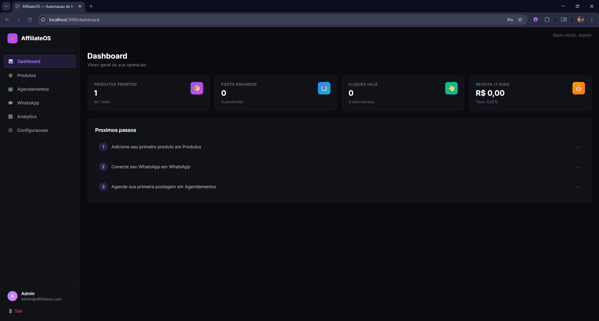
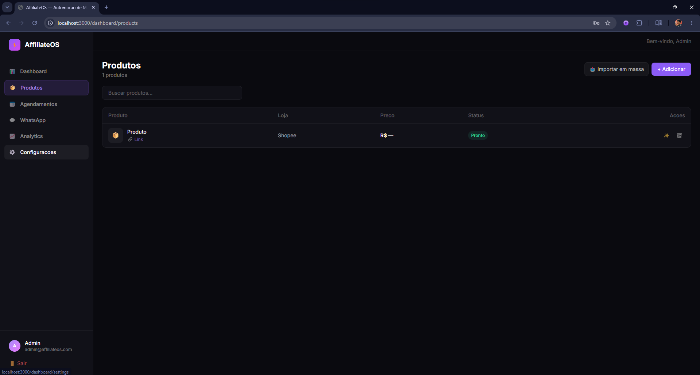

# ⚡ AffiliateOS

> Plataforma open source para automação de marketing de afiliados com integração ao WhatsApp, geração de conteúdo por IA e gerenciamento de campanhas.


---

## 📌 Sobre o Projeto

O AffiliateOS nasceu como um projeto para automatizar tarefas repetitivas do marketing de afiliados.

A ideia era simples: reduzir o tempo gasto copiando links, criando legendas, organizando campanhas e publicando ofertas em grupos do WhatsApp.

Ao longo do desenvolvimento o projeto evoluiu para uma plataforma completa com geração de conteúdo por IA, processamento de produtos, agendamento de publicações e análise de desempenho.

Embora o desenvolvimento ativo tenha sido interrompido, o projeto foi disponibilizado como **open source** para fins de estudo, aprendizado e colaboração da comunidade.

---

## ✨ Principais Recursos

* 🔍 Extração automática de informações de produtos
* ✍️ Geração de legendas promocionais com IA
* 🖼️ Geração de criativos e materiais de divulgação
* 📅 Agendamento inteligente de publicações
* 📊 Dashboard com métricas e analytics
* 📦 Importação individual ou em massa
* 📱 Integração com grupos do WhatsApp
* 🤖 Processamento automatizado de campanhas
* ⚡ Arquitetura moderna baseada em filas e workers

---

## 🛒 Plataformas Suportadas

| Plataforma    | Status |
| ------------- | ------ |
| Shopee        | ✅      |
| Mercado Livre | ✅      |
| Amazon        | ✅      |
| Shein         | ✅      |
| AliExpress    | ✅      |

---

## 🏗️ Arquitetura

O projeto foi desenvolvido utilizando uma arquitetura moderna baseada em monorepo.

```text
affiliate-platform/
├── apps/
│   ├── api/
│   └── web/
├── infra/
├── docker-compose.yml
└── README.md
```

### Backend

* Node.js
* Express
* TypeScript
* Prisma ORM
* PostgreSQL
* Redis
* BullMQ

### Frontend

* Next.js 14
* React
* TypeScript
* Tailwind CSS

### Infraestrutura

* Docker
* Docker Compose
* MinIO
* Evolution API

### Inteligência Artificial

* OpenAI
* Groq

---

## 🛠️ Tecnologias Utilizadas

| Categoria      | Tecnologia                               |
| -------------- | ---------------------------------------- |
| Frontend       | Next.js, React, TypeScript, Tailwind CSS |
| Backend        | Node.js, Express, TypeScript             |
| Banco de Dados | PostgreSQL + Prisma                      |
| Cache          | Redis                                    |
| Filas          | BullMQ                                   |
| IA             | OpenAI / Groq                            |
| Storage        | MinIO                                    |
| WhatsApp       | Evolution API                            |
| Infraestrutura | Docker                                   |

---

## 🚀 Instalação Rápida

### Clonar o projeto

```bash
git clone https://github.com/eduubrz/affiliate-platform.git
cd affiliate-platform
```

### Copiar arquivo de ambiente

```bash
cp apps/api/.env.example apps/api/.env
```

### Configurar sua chave de IA

Edite o arquivo `.env` e preencha:

```env
OPENAI_API_KEY=sua-chave-aqui
```

### Subir a infraestrutura

```bash
docker-compose up -d
```

### Executar migrações

```bash
docker-compose exec api npx prisma migrate deploy
```

### Acessar o sistema

```text
Frontend: http://localhost:3000
API: http://localhost:4000
```

Consulte o arquivo `INSTALLATION.md` para instruções completas.

---

## 📊 Funcionalidades

### Produtos

* Cadastro manual
* Importação em massa
* Processamento automático
* Organização por campanhas

### Inteligência Artificial

* Geração de legendas
* Diferentes estilos de escrita
* Conteúdo promocional automatizado

### WhatsApp

* Integração com grupos
* Agendamento de mensagens
* Distribuição automatizada
* Proteção anti-spam

### Analytics

* Cliques
* Conversões
* Receita estimada
* Desempenho de campanhas

---

## 📷 Screenshots

Adicione capturas de tela aqui.






---

## 📁 Estrutura do Projeto

```text
apps/
├── api/
│   ├── src/
│   ├── prisma/
│   └── tests/
│
├── web/
│   ├── app/
│   ├── components/
│   └── lib/

infra/
docker-compose.yml
```

---

## 🗺️ Roadmap

* [ ] Integração oficial com APIs de afiliados
* [ ] Suporte a Telegram
* [ ] Aplicativo mobile
* [ ] Multiusuário
* [ ] Sistema de planos
* [ ] Automação avançada de campanhas
* [ ] Melhorias nos analytics
* [ ] Novas integrações de IA

---

## 🤝 Contribuindo

Contribuições são muito bem-vindas.

1. Faça um fork do projeto
2. Crie uma branch para sua feature

```bash
git checkout -b minha-feature
```

3. Faça commit das alterações

```bash
git commit -m "feat: minha feature"
```

4. Envie para seu fork

```bash
git push origin minha-feature
```

5. Abra um Pull Request

---

## 📌 Status

Este projeto está disponível para estudo, aprendizado e contribuições da comunidade.

Atualmente não está em desenvolvimento ativo.

---

## 📄 Licença

Distribuído sob a licença MIT.

Consulte o arquivo LICENSE para mais informações.


---

⭐ Se este projeto foi útil para você, considere deixar uma estrela no repositório.
